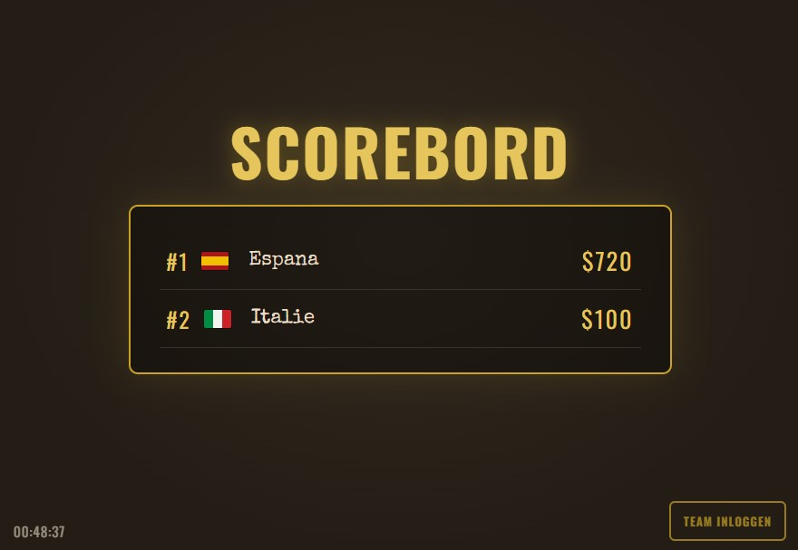
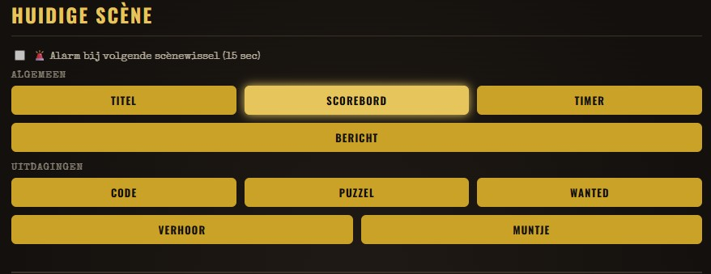
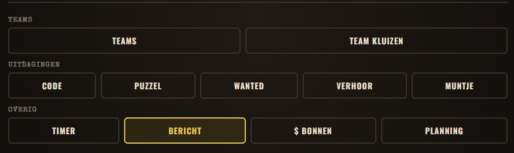
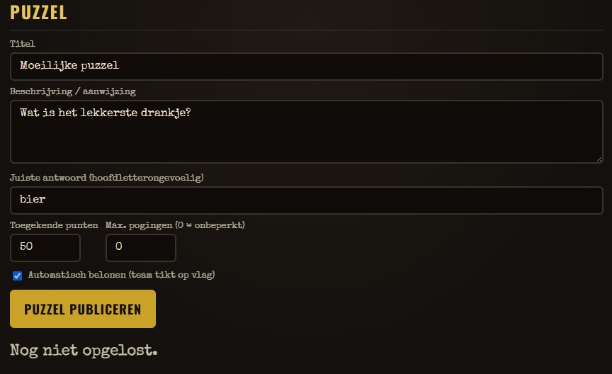
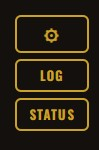

Een iPad zal centraal staan gedurende het weekend. Deze geeft de scores weer, maar biedt ook mogelijkheid tot het spelen van spelletjes om geld te verdienen. Daarnaast kunnen de teams met hun wachtwoord inloggen op hun eigen dashboard om geheime zaken in te zien.

Wat er gebeurt op iPad hebben wij in de hand via een controlepaneel op onze telefoon. Wij kiezen wat er te zien is, houden in de gaten wat de teams zelf doen, en kunnen corrigeren waar nodig.

---

## De iPad

De iPad heeft een aantal mogelijke "statische" schermen waaruit we kunnen kiezen:

| Scherm    | Omschrijving                                       |
| --------- | -------------------------------------------------- |
| Titel     | Een algemene titelpagina voor het weekend.         |
| Scorebord | Een overzicht van de "banksaldo's" van beide teams |
| Timer     | Een timer die afloopt naar 0                       |
| Bericht   | Een door ons getypte tekst, groot in beeld         |

Daarnaast kunnen we een aantal spellen spelen via de iPad:

| Scherm  | Omschrijving                                                                                  |
| ------- | --------------------------------------------------------------------------------------------- |
| Code    | Het team moet de juiste cijfercode intoetsen voor een geldbeloning                            |
| Puzzel  | Het team moet een vraag beantwoorden voor een geldbeloning                                    |
| Wanted  | Eén van de teams moet een wanted-profiel aan de juiste persoon koppelen voor een geldbeloning |
| Verhoor | Vergelijkbaar met Puzzel, alleen nu met een tijdslimiet, en een geldstraf bij fout/te laat.   |
| Muntje  | Coinflip, een team kan kiezen om te gokken voor extra/verlies geld.                           |

{ width="500" }

---

## Het Baas-paneel

Wij kunnen inloggen op het Baas-paneel. Een controlepaneel waarin wij het spel leiden en de teams in de gaten houden. Het Baas-paneel bestaat uit 4 delen: 
- Huidige scène 
- Spelkeuze 
- Spel-instellingen 
- Admin-settings

### **Huidige scène**
Door op de grote gele knoppen te klikken, wijzig je het momenteel zichtbare scherm op de iPad. Dit gebeurt live.

Bij het aanvinken van het vinkje naast `🚨 Alarm bij volgende scènewissel (15 sec)` zal er eerst gedurende 15 seconden een alarm geluid klinken, en scherm knippert rood. Vervolgens komt automatisch de gekozen scène naar voren. 
{ width="500" }
### **Spelkeuze**
Hierin kies je voor welk spel-onderdeel je instellingen wilt wijzigen. Je vind de spel-instellingen onderaan de pagina. 
{ width="500" }
### **Spel-instellingen**
Na het kiezen van de spelkeuze, kun je de instellingen ervan wijzigen.
> Tip: Zorg dat je hier alles klaar hebt staan alvorens je de Huidige Scène aanklikt.

##### Teams:
- Hier wijs je punten toe aan een team, of neem je punten van ze af. Dit doe je met de -10 en +10 knoppen, of voer zelf een bedrag in. 
- In de team kluizen zie je de dashboards van de teams. Je kunt hun eigen notities zien, en kunt Hints toevoegen of verwijderen.

##### Uitdagingen:
- Bij de Uitdagingen (spelletjes) is er de mogelijkheid om een beloning ($) toe te wijzen bij een juist voltooide uitdaging.  
- Hieronder vind je een vinkje "Automatisch belonen". Dit betekent dat na het voltooien van de uitdaging, het team zichzelf kan selecteren op het scherm om de beloning toe te wijzen. 
- Ook is er de mogelijkheid om een maximaal aantal pogingen te geven om de uitdaging te voltooien. Wil je dit niet, vul dan gewoonweg een "0" in.

##### Overig:
- Stel een timer in, of voer een bericht toe. 
- Bij $ Bonnen kunnen extra QR-codes worden gegenereerd voor het geven/ontnemen van geld door de teams. 
- Bij Planning kun je een tijd instellen wanneer een scene automatisch moet wisselen. Vooralsnog is hierbij een alarm niet mogelijk (10-aug-2026). Deze optie wordt nog toegevoegd.

{ width="500" }

### **Admin settings**
Hierin kunnen diverse instellingen zoals teamnamen en wachtwoorden gewijzigd worden. De knop "Alles Resetten" heeft een veiligheidsfunctie, maar probeer hier alsnog niet op te klikken. Deze reset het gehele spel.

Er is ook een LOG beschikbaar. Hierin worden alle acties binnen de applicatie geregistreerd.
De status-button is een technische check of alles nog naar behoren werkt. Dit venster is ook beschikbaar op de iPad door 5x achter elkaar op de tijd links onderin te klikken. 
{ width="90" }